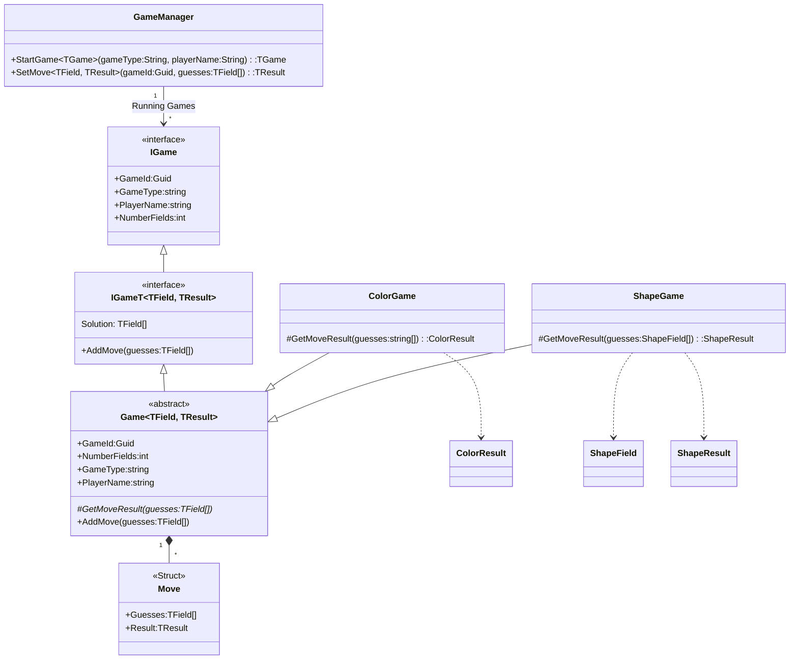
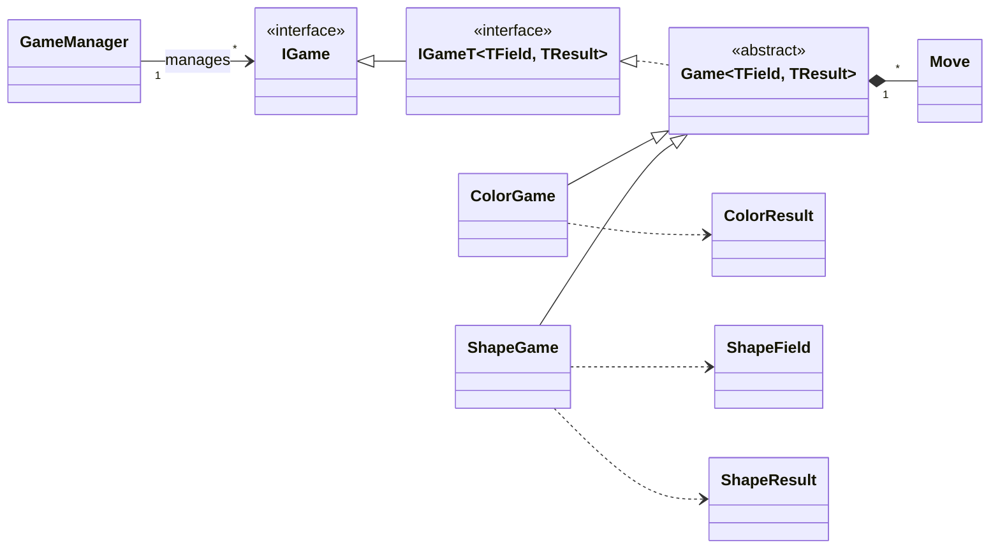

# Game Models

```mermaid
classDiagram

  IGame <|-- IGameT~TField, TResult~
  IGameT~TField, TResult~ <|-- Game~TField, TResult~

  Game "1" *-- "*" Move

  ColorGame --|> Game~string, ColorGameResult~
  ColorGame ..> ColorResult
  
  ShapeGame ..> ShapeField
  ShapeGame ..> ShapeResult
  ShapeGame --|> Game
  
  GameManager "1" --> "*" IGame : Running Games

  class IGame {
    <<interface>>
    +GameId:Guid
    +GameType:string
    +PlayerName:string
    +NumberFields:int
  }

  class IGameT~TField, TResult~{
    <<interface>>
    Solution: TField[]
    +AddMove(guesses:TField[])
  }

  class Game~TField, TResult~{
    <<abstract>>
    +GameId:Guid
    +NumberFields:int
    +GameType:string
    +PlayerName:string
    #GetMoveResult(guesses:TField[])*
    +AddMove(guesses:TField[])
  }

  class ColorGame{
    #GetMoveResult(guesses:string[]):ColorResult
  }

  class ShapeGame{
    #GetMoveResult(guesses:ShapeField[]):ShapeResult
  }

  class Move~TField, TResult~{
    <<Struct>>
    +Guesses:TField[]
    +Result:TResult
  }

  class GameManager{
    +StartGame~TGame~(gameType:String, playerName:String):TGame
    +SetMove~TField, TResult~(gameId:Guid, guesses:TField[]):TResult
  }

```

```mermaid
classDiagram
  direction TB

  IGame <|-- IGameT~TField, TResult~
  <<interface>>IGame
  IGameT~TField, TResult~ <|.. Game~TField, TResult~
  <<interface>>IGameT
  <<abstract>>Game

  ColorGame --|> Game~string, ColorGameResult~
  ColorGame ..> ColorResult
  
  ShapeGame ..> ShapeField
  ShapeGame ..> ShapeResult
  ShapeGame --|> Game

  direction LR
  
  GameManager "1" --> "*" IGame : manages

  Game "1" *-- "*" Move

```