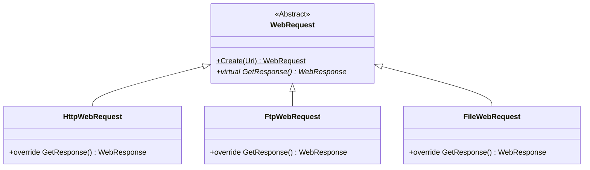
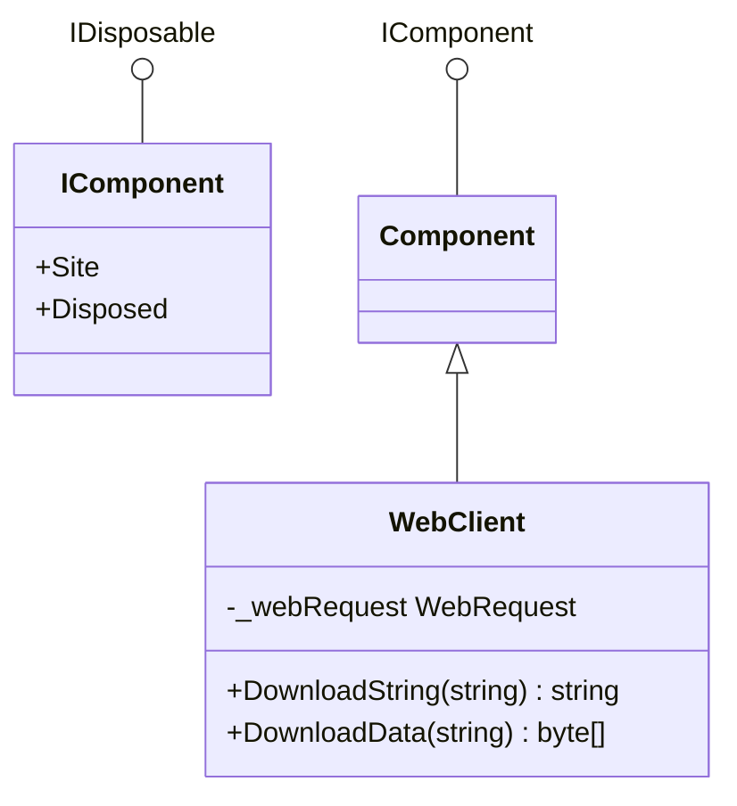
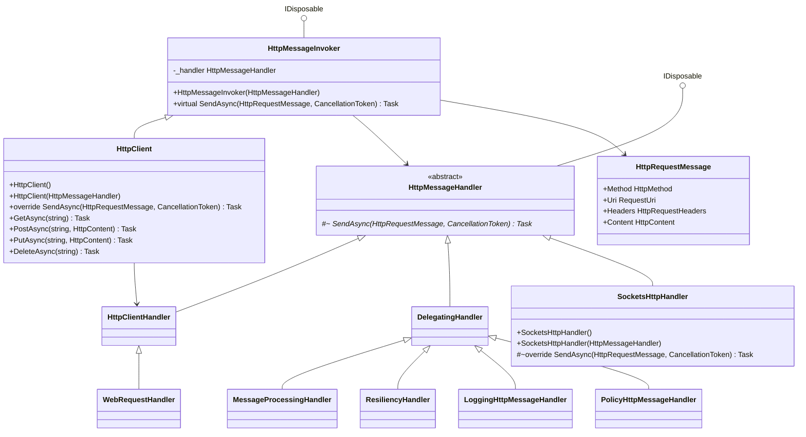

# Class Hierarchies

## Old System.Net HTTP Classes

### WebRequest

```mermaid
classDiagram
    WebRequest <|-- HttpWebRequest
    WebRequest <|-- FtpWebRequest
    WebRequest <|-- FileWebRequest

    <<Abstract>> WebRequest
    class WebRequest{
        +Create(Uri) WebRequest$
        +virtual GetResponse() WebResponse*
    }
    class HttpWebRequest{
        +override GetResponse() WebResponse
    }
    class FtpWebRequest{
        +override GetResponse() WebResponse
    }
    class FileWebRequest{
        +override GetResponse() WebResponse
    }
```

### WebClient

```mermaid
classDiagram
    class WebClient{
        -_webRequest WebRequest
        +DownloadString(string) string
        +DownloadData(string) byte[]
    }

    class IComponent{
        +Site
        +Disposed
    }
    Component <|-- WebClient 
    
    IComponent ()-- Component
    IDisposable()-- IComponent
```

## New System.Net.Http Classes

```mermaid
classDiagram
    HttpMessageInvoker <|-- HttpClient
    HttpMessageHandler <|-- HttpClientHandler
    HttpMessageHandler <|-- DelegatingHandler
    DelegatingHandler <|-- MessageProcessingHandler
    DelegatingHandler <|-- ResiliencyHandler
    DelegatingHandler <|-- LoggingHttpMessageHandler
    DelegatingHandler <|-- PolicyHttpMessageHandler
    HttpMessageHandler <|-- SocketsHttpHandler
    HttpClientHandler <|-- WebRequestHandler
    HttpMessageInvoker --> HttpMessageHandler
    HttpMessageInvoker --> HttpRequestMessage
    HttpClient --> HttpClientHandler
    
%%    note for HttpClientHandler "This is the default handler with the .NET Framework and up to .NET Core 2"
%%    note for DelegatingHandler "This is the base class for delegating requests to inner handlers"
%%    note for SocketsHttpHandler "This is the default handler with .NET Core 2.1 and up"

    IDisposable ()-- HttpMessageInvoker
    IDisposable ()-- HttpMessageHandler

    class HttpMessageInvoker{
        -_handler HttpMessageHandler
        +HttpMessageInvoker(HttpMessageHandler)
        +virtual SendAsync(HttpRequestMessage, CancellationToken) Task<HttpResponseMessage>
    }

    class HttpClient{
        +HttpClient()
        +HttpClient(HttpMessageHandler)
        +override SendAsync(HttpRequestMessage, CancellationToken) Task<HttpResponseMessage>
        +GetAsync(string) Task<HttpResponseMessage>
        +PostAsync(string, HttpContent) Task<HttpResponseMessage>
        +PutAsync(string, HttpContent) Task<HttpResponseMessage>
        +DeleteAsync(string) Task<HttpResponseMessage>
    }

    class HttpMessageHandler{
        <<abstract>>
        #~ SendAsync(HttpRequestMessage, CancellationToken) Task<HttpResponseMessage>*
    }

    class SocketsHttpHandler{
        +SocketsHttpHandler()
        +SocketsHttpHandler(HttpMessageHandler)
        #~override SendAsync(HttpRequestMessage, CancellationToken) Task<HttpResponseMessage>
    }

    class HttpRequestMessage{
        +Method HttpMethod
        +Uri RequestUri
        +Headers HttpRequestHeaders
        +Content HttpContent
    }

```