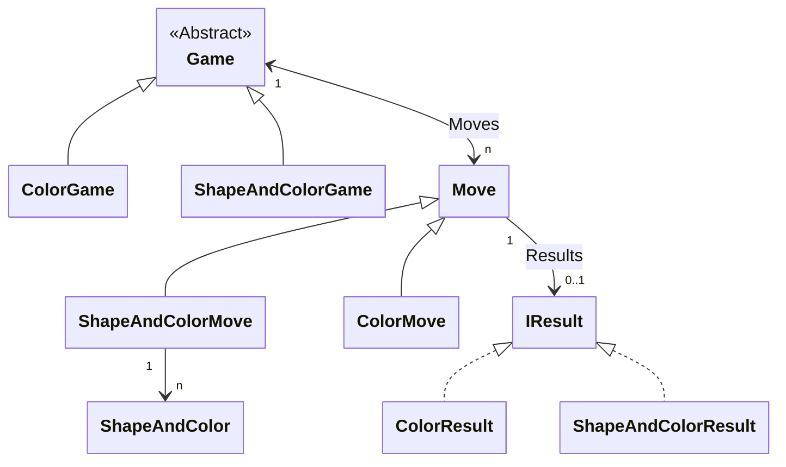

# Game Relations

```mermaid
---
  config:
    class:
      hideEmptyMembersBox: true
---
classDiagram
    Game <|-- ColorGame
    Game <|-- ShapeAndColorGame
    IResult |>.. ColorResult
    IResult |>.. ShapeAndColorResult
    Move <|-- ColorMove
    Move <|-- ShapeAndColorMove
    Game "1" <--> "n" Move : Moves
    Move "1" --> "0..1" IResult : Results
    ShapeAndColorMove "1" --> "n" ShapeAndColor

    class Game {
      <<Abstract>>
    }

   %% classDef default fill:#CDE498,font-size:16px
```