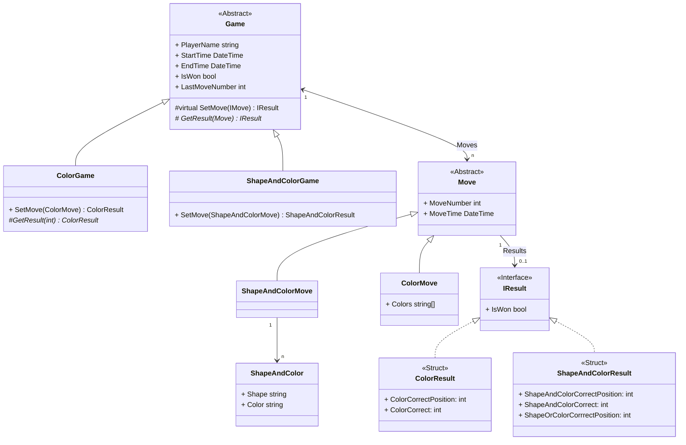

# Games

```mermaid
classDiagram
    Game <|-- ColorGame
    Game <|-- ShapeAndColorGame
    IResult |>.. ColorResult
    IResult |>.. ShapeAndColorResult
    Move <|-- ColorMove
    Move <|-- ShapeAndColorMove
    Game "1" <--> "n" Move : Moves
    Move "1" --> "0..1" IResult : Results
    ShapeAndColorMove "1" --> "n" ShapeAndColor

    class Game{
      <<Abstract>>
      + PlayerName string
      + StartTime DateTime
      + EndTime DateTime
      + IsWon bool
      + LastMoveNumber int
      #virtual SetMove(IMove) IResult
      # GetResult(Move) IResult*
    }

    class ColorGame{
      + SetMove(ColorMove) ColorResult 
      #GetResult(int) ColorResult*
    }

    class ShapeAndColorGame{
      + SetMove(ShapeAndColorMove) ShapeAndColorResult
    }

    class Move{
      <<Abstract>>
      + MoveNumber int
      + MoveTime DateTime
    }

    class ColorMove{
      + Colors string[]
    }

    class ShapeAndColor{
      + Shape string
      + Color string
    }

    class ColorResult{
      <<Struct>>
      + ColorCorrectPosition: int
      + ColorCorrect: int
    }

    class ShapeAndColorResult{
      <<Struct>>
      + ShapeAndColorCorrectPosition: int
      + ShapeAndColorCorrect: int
      + ShapeOrColorCorrrectPosition: int
    }

    class IResult{
      <<Interface>>
      + IsWon bool
    }

```
