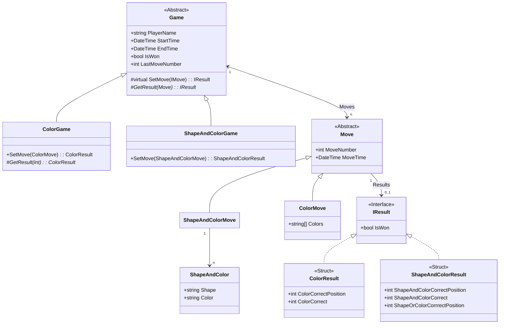

# Games

```mermaid
---
  config:
    class:
      hideEmptyMembersBox: true
---
classDiagram
    Game <|-- ColorGame
    Game <|-- ShapeAndColorGame
    IResult |>.. ColorResult
    IResult |>.. ShapeAndColorResult
    Move <|-- ColorMove
    Move <|-- ShapeAndColorMove
    Game "1" <--> "n" Move : Moves
    Move "1" --> "0..1" IResult : Results
    ShapeAndColorMove "1" --> "n" ShapeAndColor

    class Game{
      <<Abstract>>
      +string PlayerName
      +DateTime StartTime
      +DateTime EndTime
      +bool IsWon
      +int LastMoveNumber
      #virtual SetMove(IMove): IResult
      #GetResult(Move): IResult*
    }

    class ColorGame{
      +SetMove(ColorMove): ColorResult 
      #GetResult(int): ColorResult*
    }

    class ShapeAndColorGame{
      +SetMove(ShapeAndColorMove): ShapeAndColorResult
    }

    class Move{
      <<Abstract>>
      +int MoveNumber
      +DateTime MoveTime
    }

    class ColorMove{
      +string[] Colors
    }

    class ShapeAndColor{
      +string Shape
      +string Color
    }

    class ColorResult{
      <<Struct>>
      +int ColorCorrectPosition
      +int ColorCorrect
    }

    class ShapeAndColorResult{
      <<Struct>>
      +int ShapeAndColorCorrectPosition
      +int ShapeAndColorCorrect
      +int ShapeOrColorCorrrectPosition
    }

    class IResult{
      <<Interface>>
      +bool IsWon
    }

%%   classDef default fill:#CDE498,font-size:16px
```
