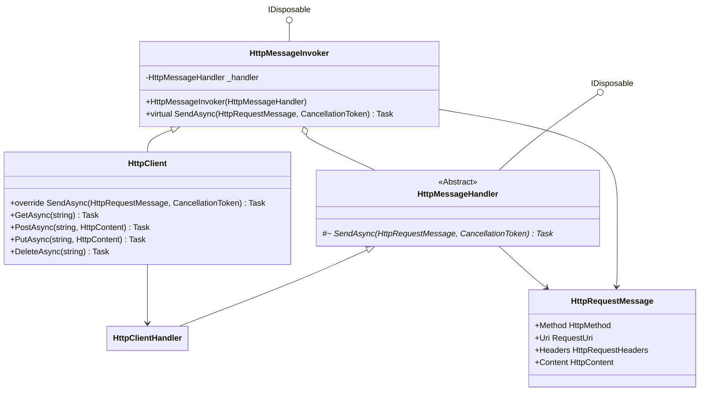

# HttpClient

```mermaid
---
  config:
    class:
      hideEmptyMembersBox: true
---
classDiagram

    IDisposable ()-- HttpMessageInvoker
    HttpMessageInvoker <|-- HttpClient
    HttpClient --> HttpClientHandler
    HttpMessageHandler <|-- HttpClientHandler
    HttpMessageHandler --> HttpRequestMessage
    HttpMessageInvoker --> HttpRequestMessage   
    HttpMessageInvoker o-- HttpMessageHandler
    IDisposable ()-- HttpMessageHandler     


    class HttpMessageInvoker{
        -HttpMessageHandler _handler
        +HttpMessageInvoker(HttpMessageHandler)
        +virtual SendAsync(HttpRequestMessage, CancellationToken) Task<HttpResponseMessage>
    }

    class HttpClient{
        +override SendAsync(HttpRequestMessage, CancellationToken) Task<HttpResponseMessage>
        +GetAsync(string) Task<HttpResponseMessage>
        +PostAsync(string, HttpContent) Task<HttpResponseMessage>
        +PutAsync(string, HttpContent) Task<HttpResponseMessage>
        +DeleteAsync(string) Task<HttpResponseMessage>
    }

    class HttpRequestMessage{
        +Method HttpMethod
        +Uri RequestUri
        +Headers HttpRequestHeaders
        +Content HttpContent
    }

    class HttpMessageHandler{
        <<Abstract>>
        #~ SendAsync(HttpRequestMessage, CancellationToken) Task<HttpResponseMessage>*
    }

%%    classDef default fill:#CDE498,font-size:16px
```