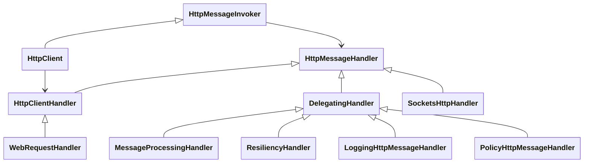

# HttpClient Handler Types

```mermaid
---
  config:
    class:
      hideEmptyMembersBox: true
---
classDiagram
    HttpMessageInvoker <|-- HttpClient
    HttpMessageHandler <|-- HttpClientHandler
    HttpMessageHandler <|-- DelegatingHandler
    DelegatingHandler <|-- MessageProcessingHandler
    DelegatingHandler <|-- ResiliencyHandler
    DelegatingHandler <|-- LoggingHttpMessageHandler
    DelegatingHandler <|-- PolicyHttpMessageHandler
    HttpMessageHandler <|-- SocketsHttpHandler
    HttpClientHandler <|-- WebRequestHandler
    HttpMessageInvoker --> HttpMessageHandler
    HttpClient --> HttpClientHandler
    
%%    note for HttpClientHandler "This is the default handler with the .NET Framework and up to .NET Core 2"
%%    note for DelegatingHandler "This is the base class for delegating requests to inner handlers"
%%    note for SocketsHttpHandler "This is the default handler with .NET Core 2.1 and up"

%%    classDef default fill:#CDE498,font-size:16px
```