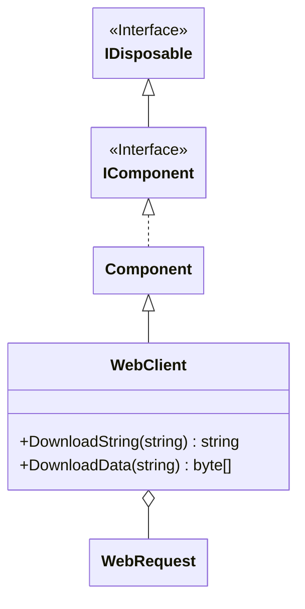

# WebClient

```mermaid
---
  config:
    class:
      hideEmptyMembersBox: true
---
classDiagram
    class WebClient{
        +DownloadString(string) string
        +DownloadData(string) byte[]
    }

    class IComponent{
        <<Interface>>
    }

    class IDisposable{
        <<Interface>>
    }

    Component <|-- WebClient 
    
    IComponent |>.. Component
    IDisposable<|-- IComponent
    WebClient o-- WebRequest

   %% classDef default fill:#CDE498,font-size:16px
```
    
