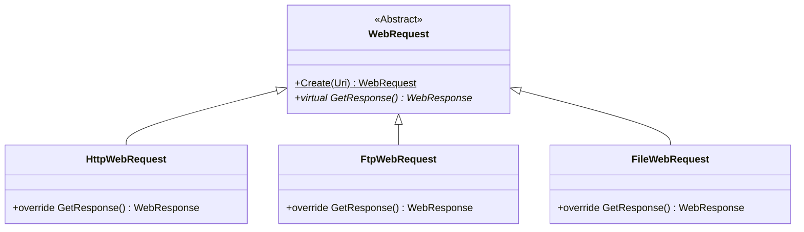

# WebRequest

```mermaid
---
  config:
    class:
      hideEmptyMembersBox: true
---
classDiagram
    WebRequest <|-- HttpWebRequest
    WebRequest <|-- FtpWebRequest
    WebRequest <|-- FileWebRequest

    <<Abstract>> WebRequest
    class WebRequest{
        +Create(Uri) WebRequest$
        +virtual GetResponse() WebResponse*
    }
    class HttpWebRequest{
        +override GetResponse() WebResponse
    }
    class FtpWebRequest{
        +override GetResponse() WebResponse
    }
    class FileWebRequest{
        +override GetResponse() WebResponse
    }

%%    classDef default fill:#CDE498,font-size:16px
```  
