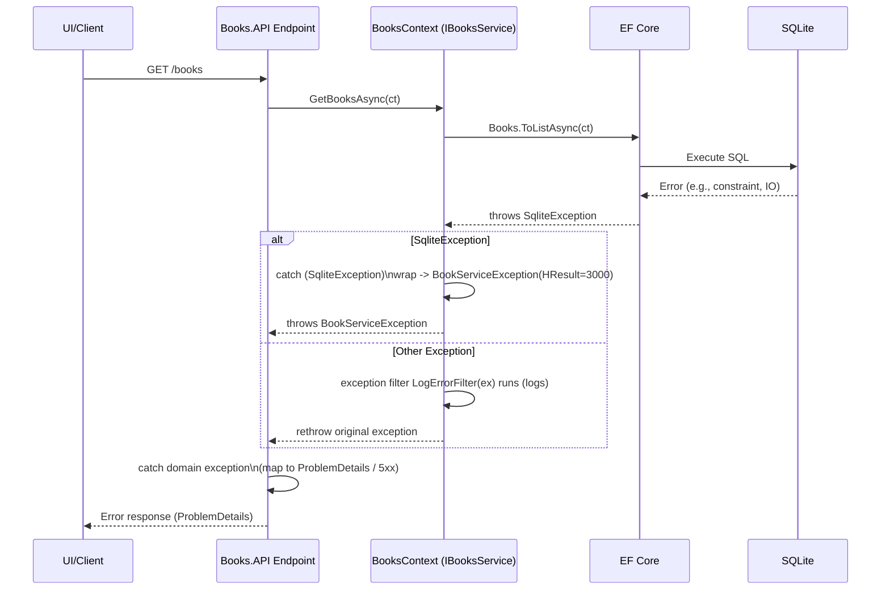

# Exceptions bubbling

```mermaid
sequenceDiagram
    participant UI as UI/Client
    participant API as Books.API Endpoint
    participant SVC as BooksContext (IBooksService)
    participant EF as EF Core
    participant DB as SQLite

    UI->>API: GET /books
    API->>SVC: GetBooksAsync(ct)
    SVC->>EF: Books.ToListAsync(ct)
    EF->>DB: Execute SQL
    DB-->>EF: Error (e.g., constraint, IO)
    EF-->>SVC: throws SqliteException

    alt SqliteException
        SVC->>SVC: catch (SqliteException)\nwrap -> BookServiceException(HResult=3000)
        SVC-->>API: throws BookServiceException
    else Other Exception
        SVC->>SVC: exception filter LogErrorFilter(ex) runs (logs)
        SVC-->>API: rethrow original exception
    end

    API->>API: catch domain exception\n(map to ProblemDetails / 5xx)
    API-->>UI: Error response (ProblemDetails)
```
