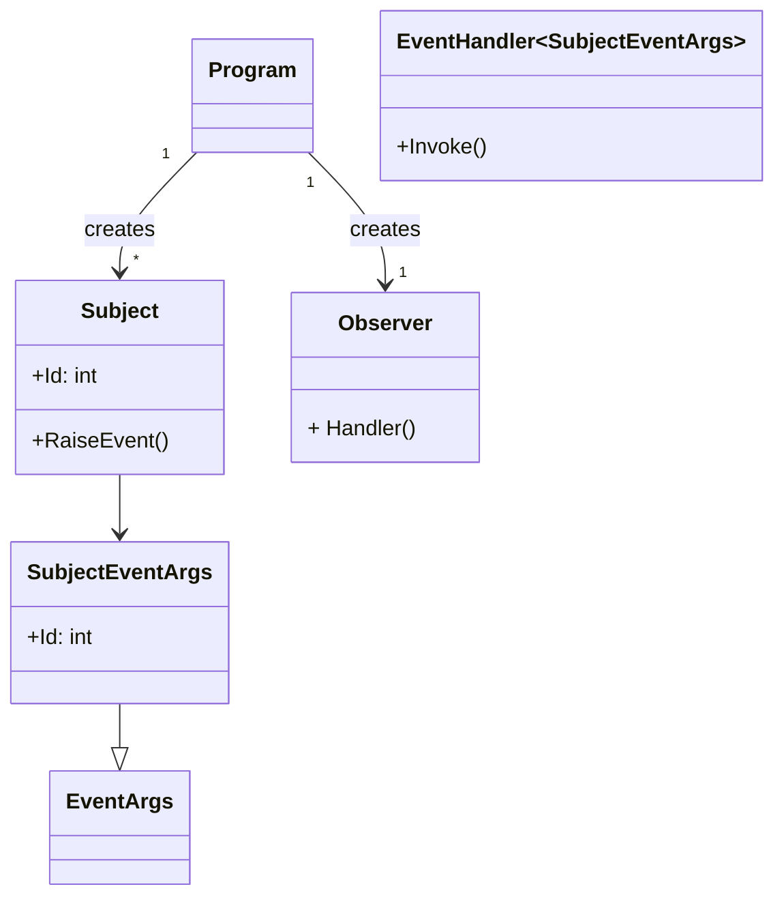
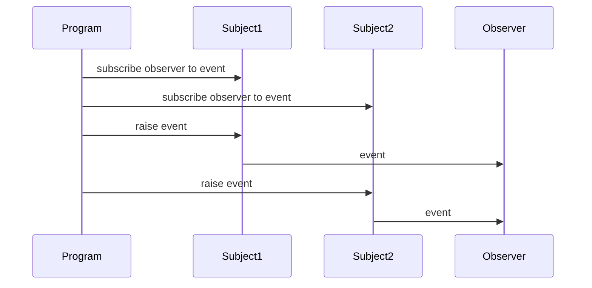

# Custom Events

```mermaid
classDiagram
  Program "1" --> "*" Subject:creates
  Program "1" --> "1" Observer:creates

  Subject  --> SubjectEventArgs
  SubjectEventArgs --|> EventArgs
  EventHandler~SubjectEventArgs~

  class SubjectEventArgs{
    +Id: int
  }

  class EventHandler~SubjectEventArgs~{
    +Invoke()
  }

  class Subject{
    +Id: int
    +RaiseEvent()
  }

  class Observer{
    + Handler()
  }

```

```mermaid
sequenceDiagram
  participant Program
  participant Subject1
  participant Subject2
  participant Observer

  Program->>Subject1: subscribe observer to event
  Program->>Subject2: subscribe observer to event
  Program->>Subject1: raise event
  Subject1->>Observer: event
  Program->>Subject2: raise event
  Subject2->>Observer: event
```