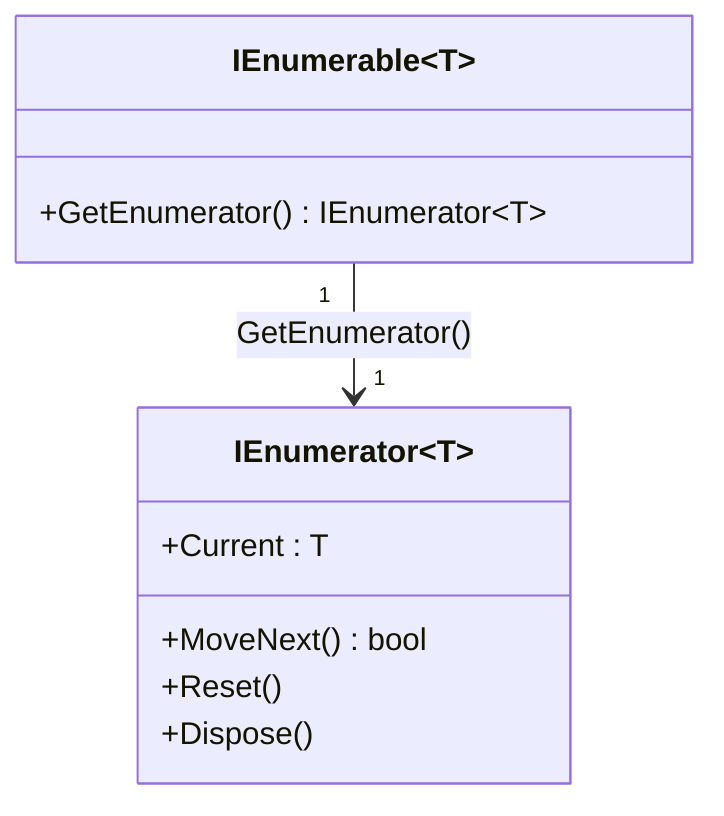
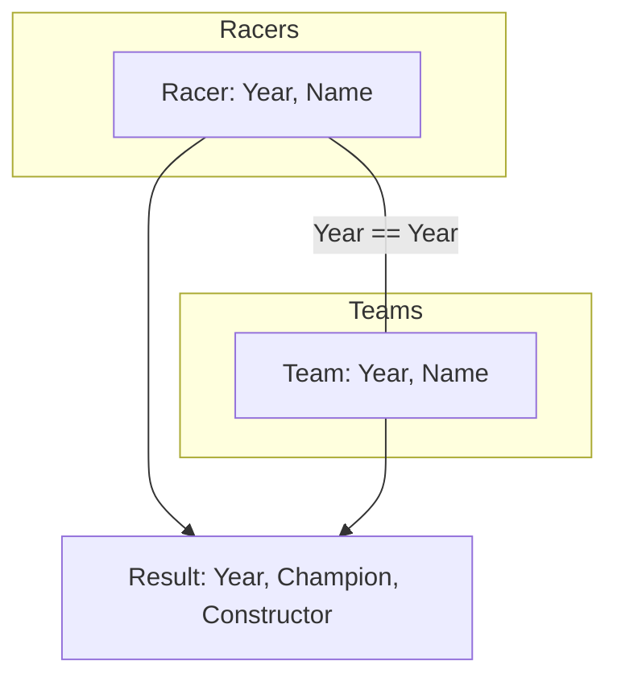
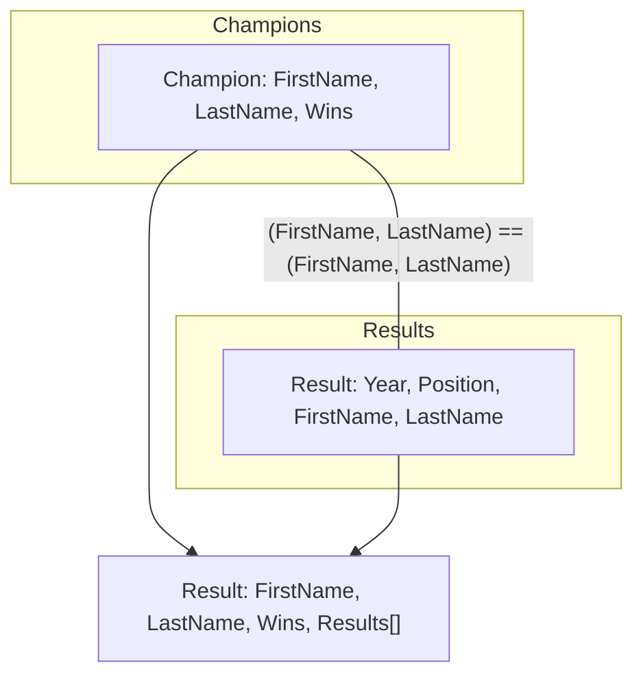
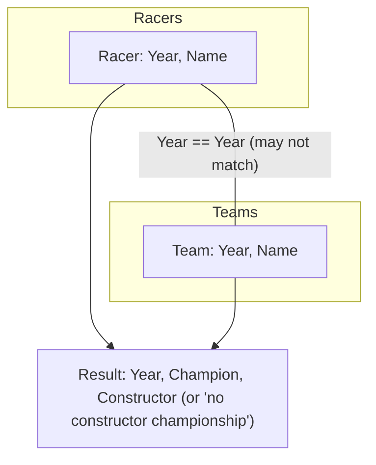

# Diagrams

## IEnumerable and IEnumerator

# Diagrams

## Inner join

InnerJoin matches only records with the same year in both sources.

## Group join

GroupJoin groups all results for each champion by name.

## Left outer join

LeftOuterJoin includes all racers, even if no matching team exists for a year.
